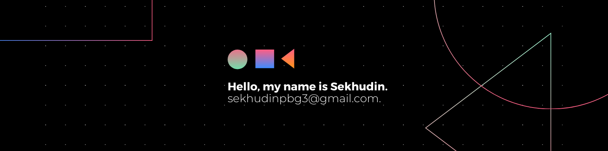

  

 

<h3 align="center">Hi there👋, I'm Sekhudin</h3>
<h2 align="center">"I am a full-stack developer 💻, who likes photography 📸"</h2>

I love creating creative websites, uncovering hidden treasures, and meeting new people. Discovering how people hide things and where others will look always excites me.

<b>
⚡ Fun fact: I'm a wizard. Shh... let's keep it down a bit.
</b>

### 🤝 Connect with me:
 
 
- 💬 If you have any question/feedback, please do not hesitate to <b><a href="mailto:sekhudinpbg3@gmail.com">reach out to me!</a><b/>
 

## 🌱 I'm currently learning
- 

## 💼 Technical Skills

 

 

 

### 📈 GitHub Stats:

